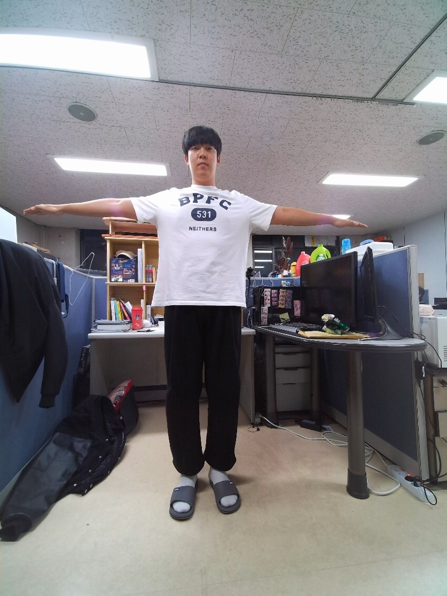
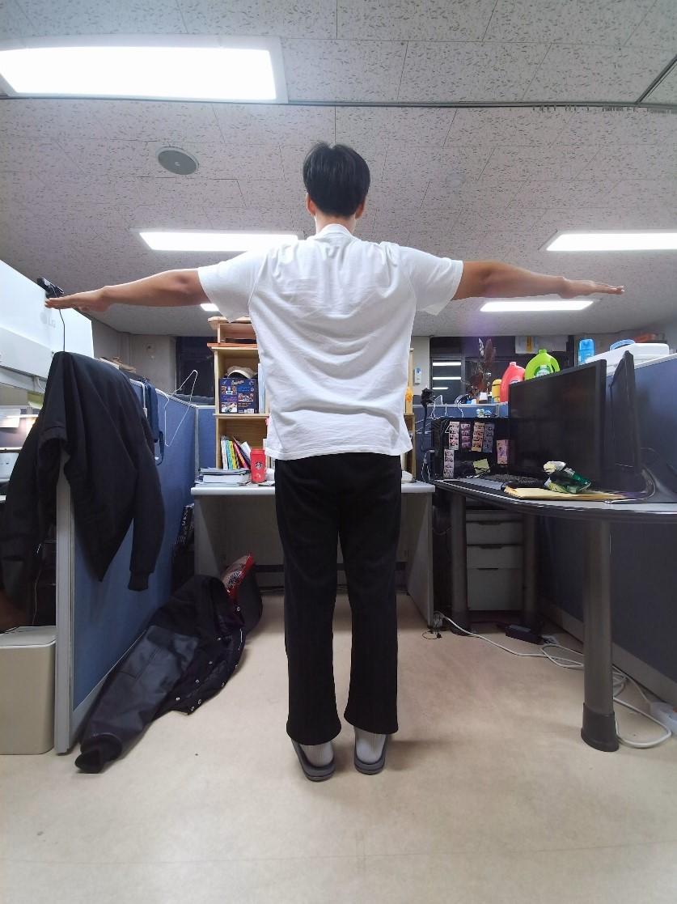
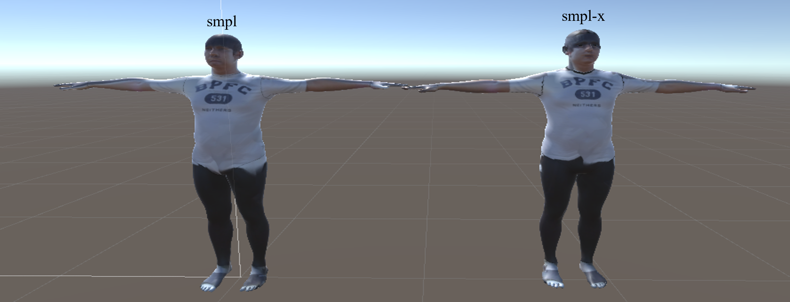
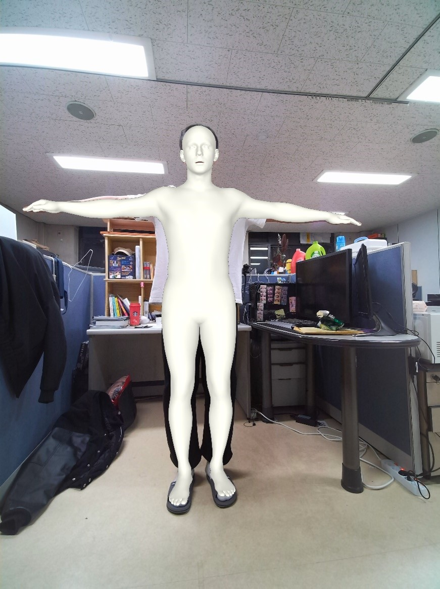
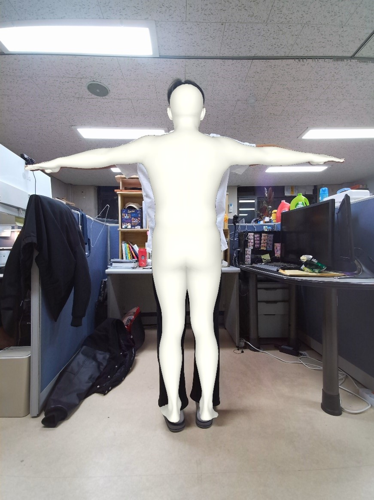
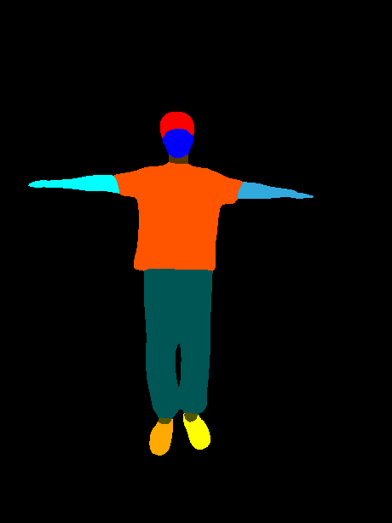
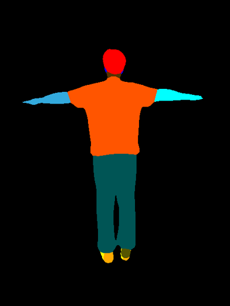

### Build textured 3D body model with two images
Example front and back images captured by Azure Kinect:  

 
 
The generated texture for SMPL and SMPLX model:  

 
The rendered result in Unity:  

## Requirement
* numpy
* scipy
* OpenCV
* [smplify-x](https://github.com/vchoutas/smplify-x)
* [openpose](https://github.com/CMU-Perceptual-Computing-Lab/openpose)

## Optional requirement

* [PGN](https://github.com/Engineering-Course/CIHP_PGN)

## Demo
We have an exmple data in `data/obj1`. The front iamge is `data/obj1/images/P01125-150055.jpg` and the back image is `data/obj1/images/P01125-150146.jpg`.

To generate the texture for SMPL model, just run:  `python demo.py data/obj1 P01125-150055.jpg P01125-150146.jpg smpl`
To generate the texture for SMPLX model, just run:  `python demo.py data/obj1 P01125-150055.jpg P01125-150146.jpg smplx`

You'll find the results in `data/obj1`

## Using your own data
### step1: prepare your image data
example can be find in `./data/obj1/images`

### step2: openpose pose detection
For Linux users, you need to complie openpose following the instruction [here](https://github.com/CMU-Perceptual-Computing-Lab/openpose), and for windows users, you can used the [windows portable demo](https://github.com/CMU-Perceptual-Computing-Lab/openpose/blob/master/doc/installation/README.md#windows-portable-demo).  
`openpose.bin --display 0  --render_pose 1 --image_dir ./data/obj1/images --write_json ./data/obj1/keypoints --write_images ./data/obj1/pose_images --hand --face`

Example image :  
 
 

### step3: fit smpl/smplx model
Please follow the instruction [here](https://github.com/vchoutas/smplify-x)  
An example command is:
`python smplifyx/main.py --config cfg_files/fit_smplx.yaml --data_folder ./data/obj1 --output_folder ./data/obj1/smplx --visualize=True  --model_folder models --vposer_ckpt vposer_v1_0`  
Please copy the output data to `./data/obj1/smplx or ./data/obj1/smpl`

Example image :  
 
 

### step4(optional): get PGN segmentation
Please follow the instruction [here](https://github.com/Engineering-Course/CIHP_PGN)  
Please copy the output data to `./data/obj1/PGN`

Example image :  
 
 

### step4: texture generation
run `python demo.py data_path front_img back_img smplx`

Example image :  
 
 

